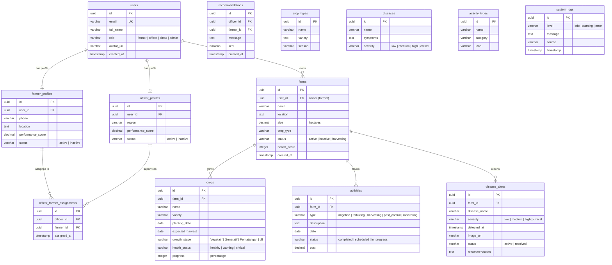

# Agrilink Database Schema Design

Dokumen ini menjelaskan rancangan basis data (*database schema*) Relasional untuk sistem **Agrilink**. Desain ini kompatibel dengan PostgreSQL dan siap digunakan untuk Supabase.

---

## 🗺️ Entity Relationship Diagram (ERD)



---

## 💾 SQL DDL Script (Supabase / PostgreSQL)

Anda dapat menyalin skrip SQL berikut langsung ke SQL Editor di Supabase untuk menggenerasi tabel beserta relasinya.

```sql
-- Enable UUID extension
create extension if not exists "uuid-ossp";

-- 1. USERS TABLE
create table public.users (
    id uuid default uuid_generate_v4() primary key,
    email varchar(255) unique not null,
    full_name varchar(255) not null,
    role varchar(50) not null check (role in ('farmer', 'officer', 'dinas', 'admin')),
    avatar_url text,
    created_at timestamp with time zone default timezone('utc'::text, now()) not null
);

-- 2. FARMER PROFILES
create table public.farmer_profiles (
    id uuid default uuid_generate_v4() primary key,
    user_id uuid references public.users(id) on delete cascade not null,
    phone varchar(20),
    location text,
    performance_score decimal(5,2) default 100.00,
    status varchar(20) default 'active' check (status in ('active', 'inactive')),
    constraint unique_farmer_user unique (user_id)
);

-- 3. OFFICER PROFILES
create table public.officer_profiles (
    id uuid default uuid_generate_v4() primary key,
    user_id uuid references public.users(id) on delete cascade not null,
    region varchar(100),
    performance_score decimal(5,2) default 100.00,
    status varchar(20) default 'active' check (status in ('active', 'inactive')),
    constraint unique_officer_user unique (user_id)
);

-- 4. OFFICER TO FARMER ASSIGNMENTS
create table public.officer_farmer_assignments (
    id uuid default uuid_generate_v4() primary key,
    officer_id uuid references public.officer_profiles(id) on delete cascade not null,
    farmer_id uuid references public.farmer_profiles(id) on delete cascade not null,
    assigned_at timestamp with time zone default timezone('utc'::text, now()) not null,
    constraint unique_assignment unique (officer_id, farmer_id)
);

-- 5. FARMS TABLE
create table public.farms (
    id uuid default uuid_generate_v4() primary key,
    user_id uuid references public.users(id) on delete cascade not null,
    name varchar(255) not null,
    location text,
    size decimal(10,2) not null, -- dalam hektar
    crop_type varchar(100),
    status varchar(50) default 'active' check (status in ('active', 'inactive', 'harvesting')),
    health_score integer default 100 check (health_score >= 0 and health_score <= 100),
    created_at timestamp with time zone default timezone('utc'::text, now()) not null
);

-- 6. CROPS TABLE
create table public.crops (
    id uuid default uuid_generate_v4() primary key,
    farm_id uuid references public.farms(id) on delete cascade not null,
    name varchar(255) not null,
    variety varchar(100),
    planting_date date not null,
    expected_harvest date,
    growth_stage varchar(100) default 'Vegetatif',
    health_status varchar(50) default 'healthy' check (health_status in ('healthy', 'warning', 'critical')),
    progress integer default 0 check (progress >= 0 and progress <= 100)
);

-- 7. ACTIVITIES TABLE
create table public.activities (
    id uuid default uuid_generate_v4() primary key,
    farm_id uuid references public.farms(id) on delete cascade not null,
    type varchar(50) not null check (type in ('irrigation', 'fertilizing', 'harvesting', 'pest_control', 'monitoring')),
    description text,
    date date not null,
    status varchar(50) default 'scheduled' check (status in ('completed', 'scheduled', 'in_progress')),
    cost decimal(12,2) default 0.00
);

-- 8. DISEASE ALERTS TABLE
create table public.disease_alerts (
    id uuid default uuid_generate_v4() primary key,
    farm_id uuid references public.farms(id) on delete cascade not null,
    disease_name varchar(255) not null,
    severity varchar(50) not null check (severity in ('low', 'medium', 'high', 'critical')),
    detected_at timestamp with time zone default timezone('utc'::text, now()) not null,
    image_url text,
    status varchar(50) default 'active' check (status in ('active', 'resolved')),
    recommendation text
);

-- 9. RECOMMENDATIONS TABLE
create table public.recommendations (
    id uuid default uuid_generate_v4() primary key,
    officer_id uuid references public.officer_profiles(id) on delete cascade not null,
    farmer_id uuid references public.farmer_profiles(id) on delete cascade not null,
    message text not null,
    sent boolean default true,
    created_at timestamp with time zone default timezone('utc'::text, now()) not null
);

-- 10. CROP TYPES (MASTER DATA)
create table public.crop_types (
    id uuid default uuid_generate_v4() primary key,
    name varchar(100) unique not null,
    variety text,
    season varchar(100)
);

-- 11. DISEASES (MASTER DATA)
create table public.diseases (
    id uuid default uuid_generate_v4() primary key,
    name varchar(255) unique not null,
    symptoms text,
    severity varchar(50) not null check (severity in ('low', 'medium', 'high', 'critical'))
);

-- 12. ACTIVITY TYPES (MASTER DATA)
create table public.activity_types (
    id uuid default uuid_generate_v4() primary key,
    name varchar(100) unique not null,
    category varchar(100),
    icon varchar(50)
);

-- 13. SYSTEM LOGS TABLE
create table public.system_logs (
    id uuid default uuid_generate_v4() primary key,
    level varchar(20) not null check (level in ('info', 'warning', 'error')),
    message text not null,
    source varchar(255),
    timestamp timestamp with time zone default timezone('utc'::text, now()) not null
);
```

---

## 🧪 Skrip Input Data Contoh (Seed Data Script)

Anda dapat menggunakan skrip ini untuk memasukkan data uji coba awal ke dalam tabel di atas:

```sql
-- INSERT USER DEMO
INSERT INTO public.users (id, email, full_name, role) VALUES 
('c8a8165b-db0a-4a25-a13f-d3b2bf8efbe1', 'farmer@demo.id', 'Budi Santoso', 'farmer'),
('c8a8165b-db0a-4a25-a13f-d3b2bf8efbe2', 'officer@demo.id', 'Dr. Rina Susanti', 'officer'),
('c8a8165b-db0a-4a25-a13f-d3b2bf8efbe3', 'dinas@demo.id', 'Kepala Dinas Pertanian', 'dinas'),
('c8a8165b-db0a-4a25-a13f-d3b2bf8efbe4', 'admin@demo.id', 'Admin Utama', 'admin');

-- INSERT PROFILES
INSERT INTO public.farmer_profiles (user_id, phone, location, performance_score, status) VALUES
('c8a8165b-db0a-4a25-a13f-d3b2bf8efbe1', '081234567890', 'Desa Suka Maju', 92.00, 'active');

INSERT INTO public.officer_profiles (user_id, region, performance_score, status) VALUES
('c8a8165b-db0a-4a25-a13f-d3b2bf8efbe2', 'Kec. Tani Makmur', 94.00, 'active');

-- INSERT ASSIGNMENT
INSERT INTO public.officer_farmer_assignments (officer_id, farmer_id) VALUES
((SELECT id FROM public.officer_profiles WHERE user_id = 'c8a8165b-db0a-4a25-a13f-d3b2bf8efbe2'), 
 (SELECT id FROM public.farmer_profiles WHERE user_id = 'c8a8165b-db0a-4a25-a13f-d3b2bf8efbe1'));

-- INSERT FARMS
INSERT INTO public.farms (id, user_id, name, location, size, crop_type, status, health_score) VALUES
('d8a8165b-db0a-4a25-a13f-d3b2bf8efbe1', 'c8a8165b-db0a-4a25-a13f-d3b2bf8efbe1', 'Lahan Padi A1', 'Desa Suka Maju, Kec. Tani Makmur', 2.5, 'Padi', 'active', 92);

-- INSERT CROPS
INSERT INTO public.crops (farm_id, name, variety, planting_date, expected_harvest, growth_stage, health_status, progress) VALUES
('d8a8165b-db0a-4a25-a13f-d3b2bf8efbe1', 'Padi IR64', 'IR64', '2026-04-15', '2026-07-20', 'Vegetatif', 'healthy', 65);

-- INSERT ACTIVITIES
INSERT INTO public.activities (farm_id, type, description, date, status, cost) VALUES
('d8a8165b-db0a-4a25-a13f-d3b2bf8efbe1', 'fertilizing', 'Pemupukan NPK fase vegetatif', '2026-06-18', 'completed', 250000);
```
